# 运行证据

原始命令、结果和未完成项见 [验收报告](IMPLEMENTATION_REPORT.md) 与 [阶段记录](MILESTONES.md)。这些图片来自运行中的 Flutter，没有使用设计PNG替代运行证据。

## M0：原生空态

基础界面截图在M1测试时采集；后端基础阶段无GUI，见 [health返回](evidence/m0-live.json)。

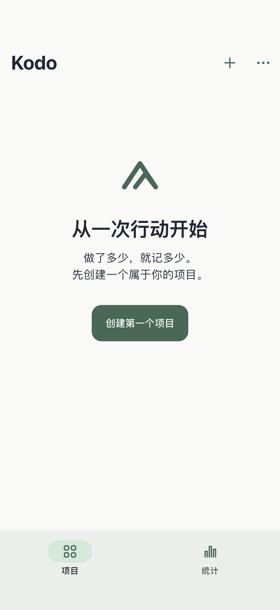

## M1：同一安装强制终止，再启动仍为10

[重启命令与断言](evidence/m1-ios-same-install.log) · [数据库结果](evidence/m1-same-install-database.json)

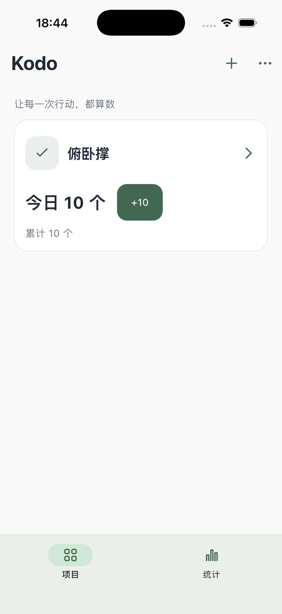

## M2：详情与统计

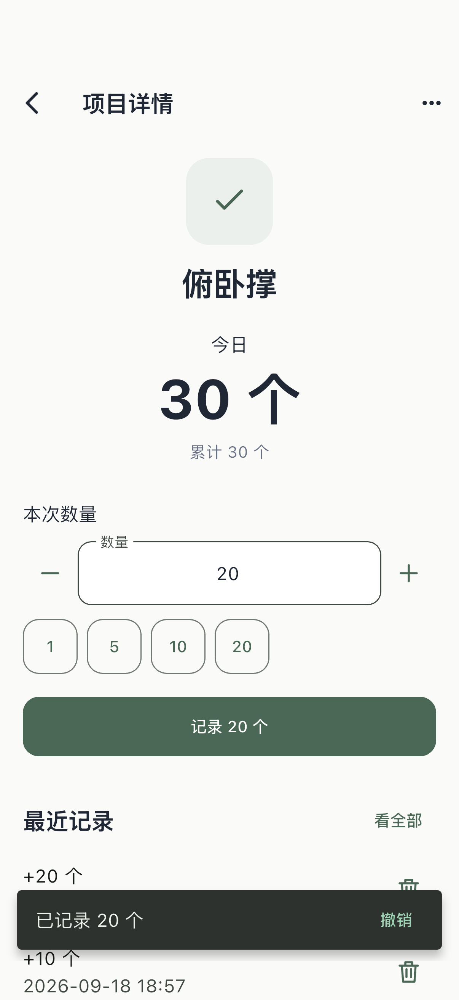

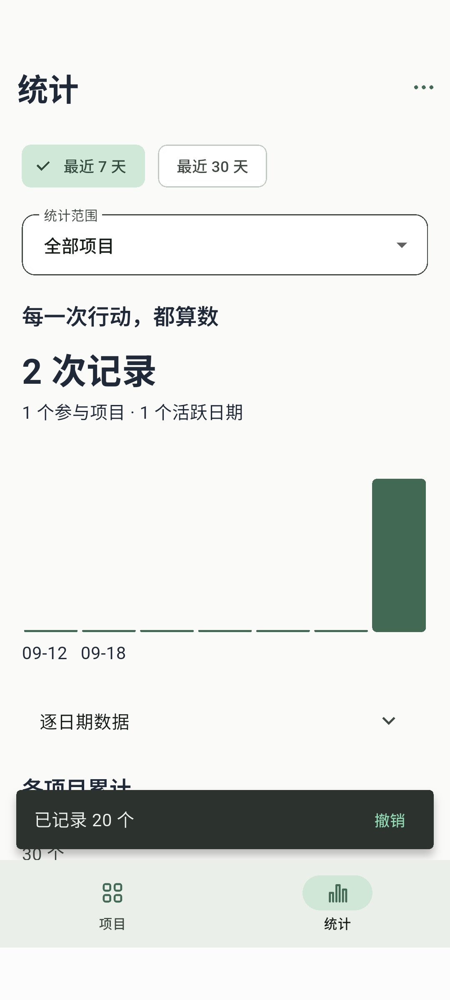

## M3：真实Rust API

这是无GUI服务阶段，不制造界面截图。实际HTTP结果：[28项smoke报告](evidence/m3-smoke.json)；数据库/协议：[7组Rust集成测试](evidence/final-cargo-test.log)。下一个阶段截图对应手机与此服务联调后的状态。

## M4：许可、同步与删除

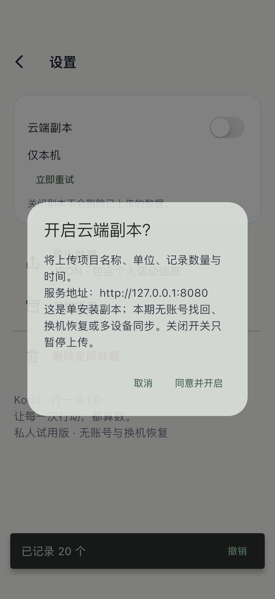

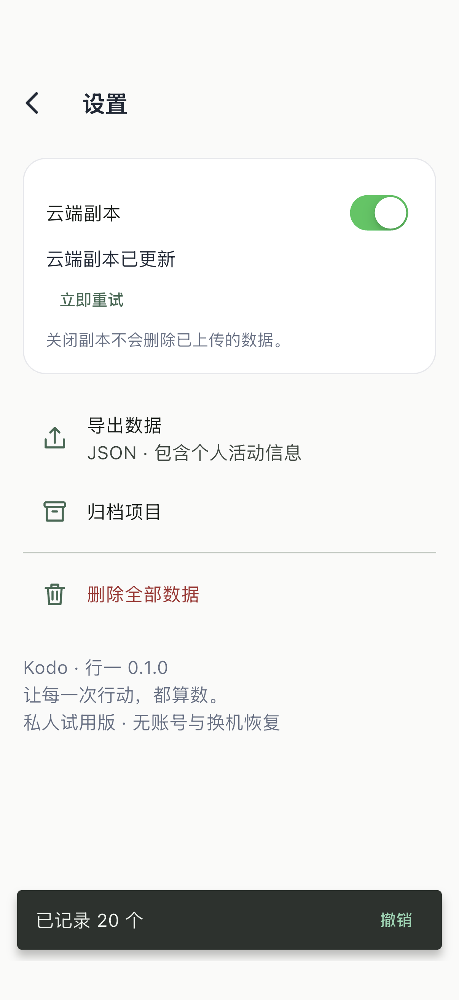

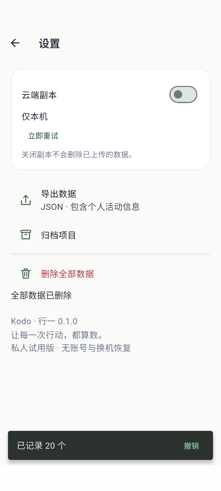

## M5：尺寸与字号

这些是实际Flutter Widget渲染，测试时读取本机系统字体；字体没有打包或分发。截图为候选基线，未宣称已经人工批准为像素golden。

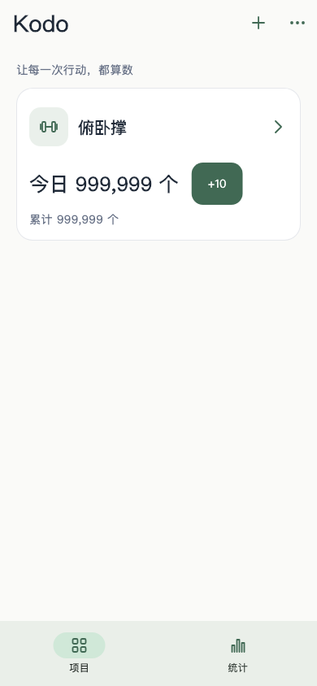

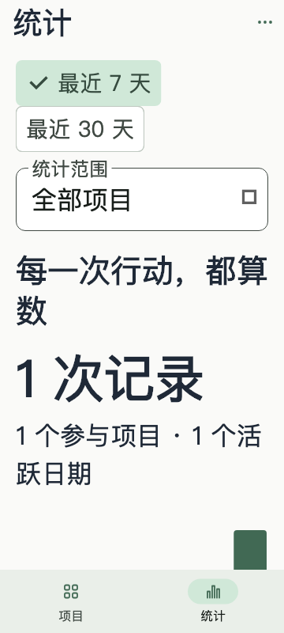

[真实iOS完整流程短录屏](evidence/m5-ios-flow-short.mp4)

## M6：构建与恢复

该阶段以构建日志和机器结果验收，无独立产品页面。

[Android APK构建](evidence/m6-android-build.log) · [iOS未签名构建](evidence/m6-ios-build.log) · [备份恢复结果](evidence/m6-backup-report.json) · [Docker网络阻塞](evidence/m6-docker-build.log)

真机、人工读屏、profile性能、系统分享最终落盘和图标蒙版仍未验收，详见报告。

## Android 真机 · 2026-09-21

详见 [真机补验与性能方法](PHYSICAL_DEVICE_REPORT.md)。下列均为小米Android16运行画面。

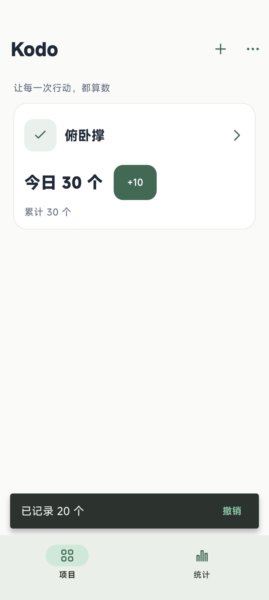

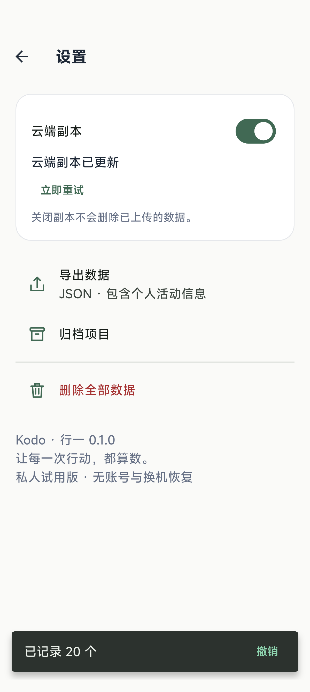

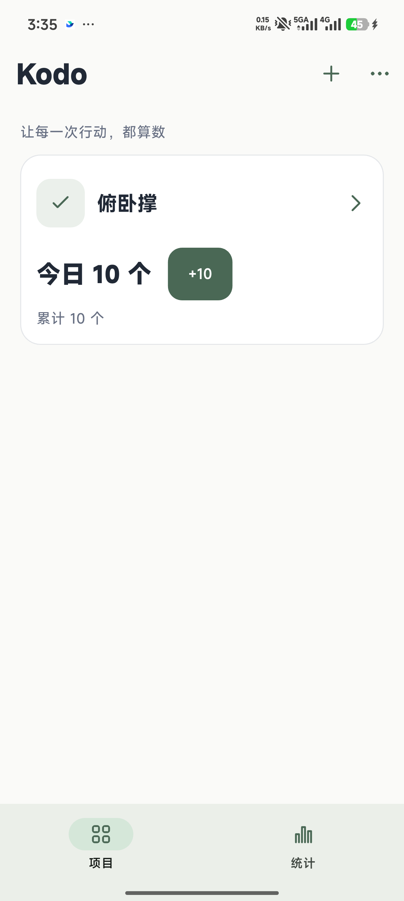

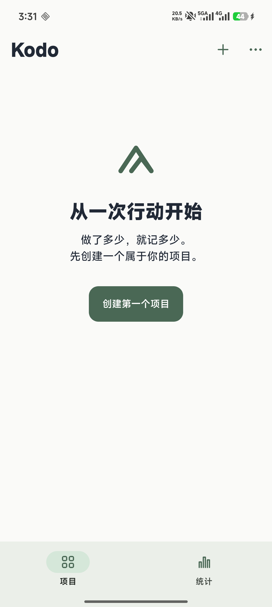

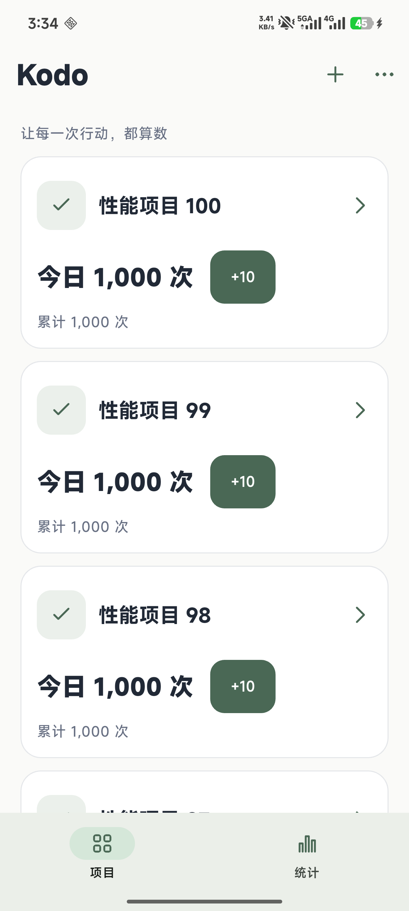
